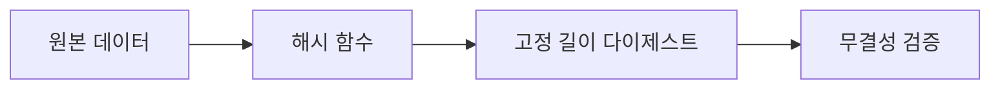

## 암호학은 비밀보다 검증의 기술입니다

zkTLS를 이해하려면 암호학을 단순히 내용을 숨기는 도구가 아니라, 어떤 계산과 출처를 검증 가능하게 만드는 언어로 보아야 합니다. 해시는 데이터의 짧은 지문을 만들고, 대칭키 암호화는 빠른 보호 채널을 만들며, 공개키 암호화와 전자서명은 네트워크 위에서 신원을 검증하게 해줍니다. 이 장의 목표는 수식의 세부 증명보다, TLS transcript와 영지식 증명이 왜 이런 재료들을 필요로 하는지 직관을 세우는 것입니다.

<div className="callout">
  <p>모든 예시는 교육용 로컬 시뮬레이션입니다. 실제 계정, 쿠키, 토큰, PII, 금융/소셜 API를 사용하지 않습니다.</p>
</div>



## 대칭키 암호화와 공개키 암호화

대칭키 암호화는 같은 키로 잠그고 여는 방식입니다. AES-GCM 같은 AEAD 모드는 암호화와 무결성 확인을 함께 제공하므로 TLS 레코드 계층에서 매우 중요합니다. 장점은 빠른 속도이고, 단점은 키를 어떻게 안전하게 합의할지입니다. 공개키 암호화는 이 문제의 다른 절반을 해결합니다. 서버는 인증서 안의 공개키로 자신의 신원을 증명하고, 클라이언트와 서버는 Diffie-Hellman 계열 키 교환으로 세션 키를 합의합니다.

```ts
const plaintext = "local transcript fragment";
const aad = "chapter-1-demo";

const record = {
  algorithm: "AES-GCM",
  aad,
  ciphertext: "교육용 더미 값",
  tag: "무결성 확인용 더미 태그",
};

console.log(plaintext, record);
```

대칭키와 공개키는 경쟁 관계가 아닙니다. TLS에서는 공개키 기반 인증과 키 교환으로 안전하게 공유 비밀을 만들고, 실제 애플리케이션 데이터는 대칭키로 빠르게 보호합니다. zkTLS에서는 이 과정에서 만들어지는 transcript, 키 파생 구조, 응답 무결성의 일부를 증명 시스템이 다룰 수 있는 형태로 바꾸는 것이 핵심입니다.

## 해시 함수와 디지털 서명

해시 함수는 임의 길이 입력을 고정 길이 출력으로 압축합니다. 좋은 해시 함수는 입력이 조금만 바뀌어도 출력이 크게 달라지고, 출력만 보고 원본을 복원하기 어렵습니다. 디지털 서명은 메시지와 개인키로 서명을 만들고, 공개키로 그 서명이 올바른지 확인합니다. 이 조합은 패키지 배포, 인증서, 블록체인 트랜잭션, 증명 검증 시스템에서 모두 반복됩니다.

```ts
async function sha256Hex(input: string) {
  const bytes = new TextEncoder().encode(input);
  const digest = await crypto.subtle.digest("SHA-256", bytes);
  return [...new Uint8Array(digest)]
    .map((byte) => byte.toString(16).padStart(2, "0"))
    .join("");
}

await sha256Hex("membershipTier=gold");
```

zkTLS에서 해시는 원본 응답을 전부 노출하지 않고도 특정 데이터 조각이 같은 transcript에서 왔음을 연결하는 데 쓰입니다. 예를 들어 응답 JSON 전체를 공개하지 않고, 특정 필드의 조건만 증명하려면 원본과 선택 공개 데이터 사이의 결합을 안전하게 표현해야 합니다.

## MAC, AEAD, 커밋먼트

MAC은 메시지 인증 코드입니다. 같은 비밀 키를 가진 쪽만 올바른 태그를 만들 수 있으므로, 수신자는 메시지가 중간에서 바뀌지 않았는지 확인할 수 있습니다. AEAD는 암호화와 인증을 묶은 구조입니다. AES-GCM은 대표적인 AEAD 모드이며 TLS 1.2 이후 실무에서 널리 쓰였습니다.

커밋먼트는 값을 지금 공개하지 않으면서 나중에 같은 값임을 열어 보일 수 있는 약속입니다. 실제 프로토콜에서는 난수, 해시, 도메인 분리 문자열이 함께 쓰입니다. 이 가이드의 데모는 보안용 구현이 아니라 구조를 보여주는 장난감 모델입니다.

```ts
const value = "tier:gold";
const salt = "local-demo-salt";
const commitment = await sha256Hex(`${salt}:${value}`);

console.log({ commitment });
```

> zkTLS의 핵심 질문은 “데이터를 어떻게 가져왔는가?”와 “그 데이터의 어떤 조건만 공개해도 충분한가?”입니다.

이제 TLS 장으로 넘어가면 위의 기본 재료들이 브라우저와 서버 사이에서 어떤 순서로 조립되는지 확인할 수 있습니다.
