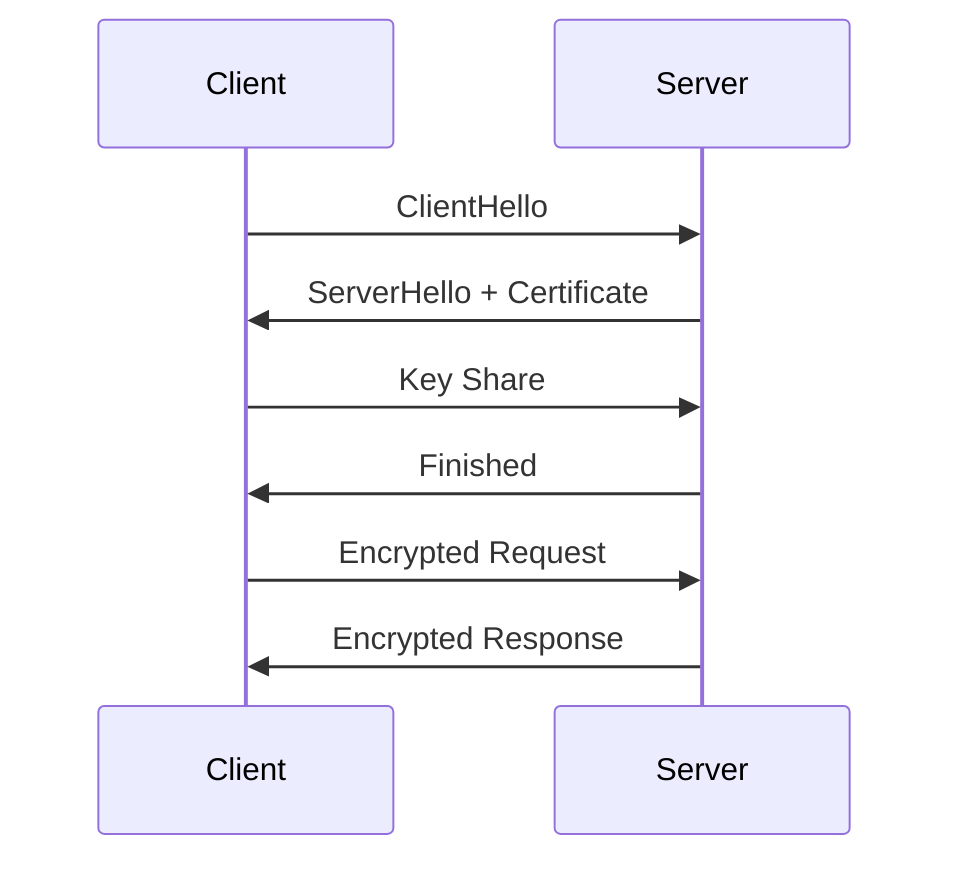

## TLS는 웹의 기본 신뢰 계층입니다

TLS는 브라우저와 서버 사이의 통신을 암호화하고, 사용자가 의도한 서버와 대화하고 있는지 확인합니다. HTTPS 주소를 열 때 브라우저는 서버 인증서를 검증하고, 세션 키를 합의한 다음, 이후 요청과 응답을 암호화된 레코드로 주고받습니다. zkTLS는 이 흐름을 깨는 기술이 아니라, 사용자가 받은 TLS 기반 데이터를 최소 공개 방식으로 증명하려는 계층입니다.



<InteractiveTLS />

## HTTPS와 TLS의 역할

HTTP는 요청과 응답의 의미를 정합니다. TLS는 그 요청과 응답이 네트워크를 지나는 동안 읽히거나 바뀌지 않도록 보호합니다. 사용자가 `https://example.invalid` 같은 주소에 접속한다고 가정하면, 애플리케이션 계층은 `GET /profile`을 말하지만 전송 계층에서는 암호화된 TLS 레코드가 오갑니다.

```ts
const transcript = [
  "ClientHello: local-demo",
  "ServerHello: mock-server",
  "Certificate: example.invalid",
  "Finished: ok",
];

const transcriptText = transcript.join("\n");
```

이 transcript는 실제 인증서나 실제 서버 응답이 아닙니다. 문서 안에서 구조를 설명하기 위한 로컬 문자열입니다. 하지만 개념적으로는 핸드셰이크 메시지가 서로 누적되고, 그 누적 상태가 이후 키 파생과 Finished 검증에 영향을 준다는 점을 보여줍니다.

## TLS 1.2와 TLS 1.3 핸드셰이크

TLS 1.2는 여러 키 교환 모드를 지원했고, 과거 호환성을 위해 복잡한 선택지가 많았습니다. TLS 1.3은 불필요한 알고리즘을 제거하고, 기본적으로 forward secrecy를 제공하는 Diffie-Hellman 계열 키 교환을 중심에 둡니다. 핸드셰이크 왕복 횟수도 줄어들어 더 빠르고 단순한 보안 모델을 제공합니다.

zkTLS 관점에서 중요한 차이는 “어떤 메시지가 언제 암호화되고, 어떤 transcript가 어떤 키에 묶이는가”입니다. 증명 시스템은 응답을 통째로 공개하지 않으려 하기 때문에, 응답이 특정 TLS 세션에서 왔다는 사실과 선택 공개 정책을 정교하게 연결해야 합니다.

## PKI와 X.509 인증서

브라우저가 서버를 신뢰하려면 인증서 체인이 필요합니다. 서버 인증서는 도메인 이름, 공개키, 유효 기간, 발급자 정보를 담고 있고, 브라우저는 루트 인증 기관까지 이어지는 체인을 검증합니다. 이 과정은 “내가 지금 말하는 상대가 정말 그 도메인의 서버인가?”라는 질문에 답합니다.

```json
{
  "subject": "example.invalid",
  "issuer": "Local Demo CA",
  "publicKey": "mocked-public-key",
  "validFor": "교육용 예시"
}
```

## 기존 TLS의 한계와 zkTLS의 문제 설정

일반 TLS는 통신 당사자인 클라이언트와 서버를 보호하도록 설계되었습니다. 제3자 검증자에게 “내가 어떤 서버에서 이런 응답을 받았다”는 사실을 최소 공개 방식으로 증명하는 기능은 기본 목표가 아닙니다. 사용자가 응답 전체를 스크린샷으로 제출하면 개인정보가 과도하게 노출되고, 단순 복사본은 출처와 무결성을 강하게 보장하지 못합니다.

zkTLS는 이 간극을 다룹니다. 목표는 원본 데이터를 모두 넘기는 것이 아니라, 로컬 transcript와 선택 공개 정책을 바탕으로 검증 가능한 주장을 만드는 것입니다.

<div className="callout">
  <p>이 가이드에서는 실제 서비스에 요청하지 않습니다. 더미 transcript와 로컬 JSON으로 TLS 구조와 증명 흐름만 학습합니다.</p>
</div>
