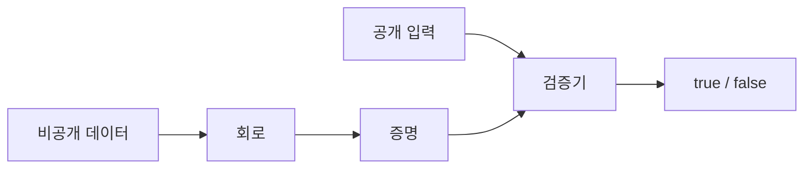
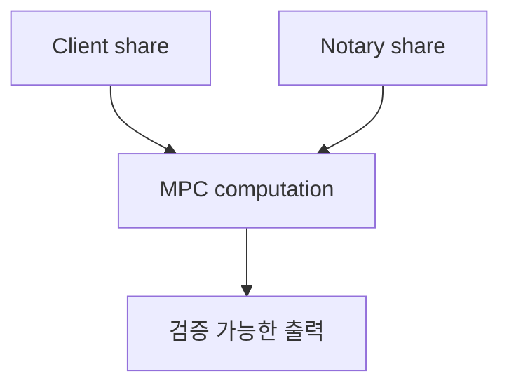

## 덜 공개하고도 더 확실히 검증하기

고급 암호학의 목표는 원본 데이터를 더 많이 모으는 것이 아닙니다. 오히려 필요한 사실만 검증하고, 나머지는 숨기는 방향으로 시스템을 설계합니다. zkTLS에서는 사용자가 가진 TLS 기반 응답에서 조건을 계산하고, 그 조건이 참이라는 증명을 검증자에게 전달하려 합니다. 이때 영지식 증명, MPC, 커밋먼트, 머클 트리, 회로가 서로 다른 역할을 맡습니다.



## 영지식 증명의 세 가지 감각

영지식 증명은 보통 완전성, 건전성, 영지식성으로 설명합니다. 완전성은 올바른 증명자가 참인 명제를 증명하면 검증자가 받아들인다는 뜻입니다. 건전성은 거짓 명제를 참처럼 속이기 어렵다는 뜻입니다. 영지식성은 검증자가 명제의 참 여부 이상을 배우지 않는다는 뜻입니다.

예를 들어 사용자가 “로컬 응답의 멤버십 등급이 gold다”를 증명한다고 해봅시다. 검증자는 등급 조건이 참이라는 사실만 알면 충분합니다. 원본 응답의 이름, 이메일, 내부 메모, 세션 식별자는 필요하지 않습니다.

```ts
type PrivateInput = {
  membershipTier: "free" | "gold";
  points: number;
};

type PublicClaim = {
  requiredTier: "gold";
  minimumPoints: number;
};

function predicate(input: PrivateInput, claim: PublicClaim) {
  return input.membershipTier === claim.requiredTier &&
    input.points >= claim.minimumPoints;
}
```

## zk-SNARK와 zk-STARK

zk-SNARK는 짧은 증명과 빠른 검증으로 유명합니다. 많은 시스템에서 온체인 검증 비용을 줄이는 데 유리합니다. 다만 설정 과정, 곡선 선택, 구현 세부사항에 대한 주의가 필요합니다. zk-STARK는 투명한 설정과 해시 기반 구조를 강조하며, 큰 계산을 다루는 데 강점이 있습니다. 대신 증명 크기가 커질 수 있고, 검증 비용과 개발 도구 생태계가 선택에 영향을 줍니다.

실무에서는 “어느 쪽이 항상 더 좋다”보다 “어떤 명제를 어디에서 검증할 것인가”가 더 중요합니다. 브라우저에서 증명을 만들 것인지, 서버에서 보조 연산을 할 것인지, 온체인에서 검증할 것인지에 따라 선택이 달라집니다.

## MPC와 Garbled Circuits

MPC는 여러 참여자가 각자의 입력을 숨기면서 공동 계산을 수행하는 기술입니다. Garbled Circuit은 2자 계산에서 자주 설명되는 방식으로, 회로의 각 와이어 값을 암호화된 라벨처럼 다룹니다. zkTLS의 일부 접근은 TLS 세션의 민감한 값을 단일 참여자가 모두 알지 못하도록 나누고, 필요한 검증만 수행하게 만듭니다.



MPC를 사용하면 단순 proxy 방식보다 개인정보 노출면을 줄일 수 있지만, 프로토콜은 더 복잡해집니다. 지연 시간, 실패 복구, 악의적 참여자 모델, 구현 감사가 모두 중요합니다.

<div className="callout">
  <p>영지식 증명은 거짓을 참으로 만드는 도구가 아닙니다. 올바른 입력과 올바른 계산을 검증 가능하게 압축하는 도구입니다.</p>
</div>
