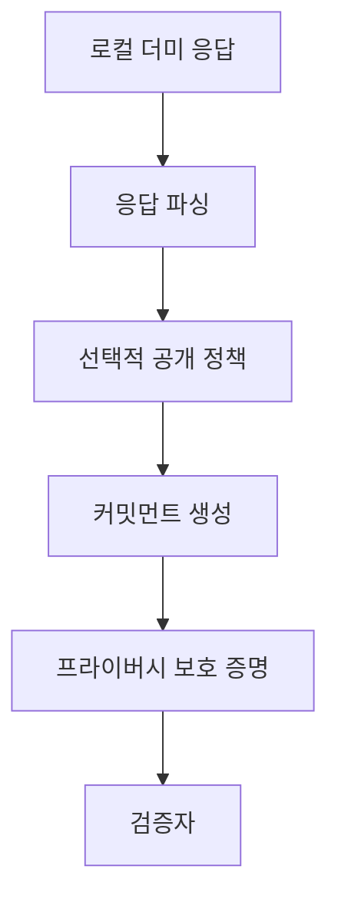

## zkTLS는 TLS 데이터에서 필요한 사실만 증명합니다

zkTLS의 핵심 목표는 사용자가 웹에서 받은 데이터를 전부 제출하지 않고, 특정 조건만 검증 가능하게 제시하는 것입니다. 예를 들어 “로컬 샌드박스 응답의 멤버십 등급이 gold다”라는 사실만 증명하고, 이름, 이메일, 내부 토큰 같은 필드는 숨길 수 있습니다. 중요한 점은 데이터 출처와 계산 과정을 동시에 다루어야 한다는 것입니다.



## 등장 배경과 사용 사례

Web2 서비스에는 사용자의 상태, 결제 이력, 평판, 계정 속성, 구독 등급 같은 데이터가 많습니다. Web3 또는 독립 검증 시스템은 이런 데이터의 일부 조건을 알고 싶어 하지만, 원본 계정 전체를 요구해서는 안 됩니다. zkTLS는 사용자가 가진 데이터를 최소 공개 방식으로 증명하는 오라클 계층으로 이해할 수 있습니다.

이 문서의 예시는 모두 로컬 더미 데이터입니다. 실제 서비스 데이터 연결은 다루지 않습니다. 대신 다음과 같은 추상 명제를 생각합니다.

```json
{
  "source": "local-sandbox",
  "membershipTier": "gold",
  "points": 1200,
  "internalNote": "hidden"
}
```

공개하고 싶은 주장은 “membershipTier가 gold이고 points가 1000 이상이다”입니다. 숨기고 싶은 값은 내부 메모, 세션 식별자, 불필요한 사용자 속성입니다.

## Proxy 방식과 MPC 방식

Proxy 방식은 중간 서버가 요청과 응답을 관찰하고 증명에 필요한 자료를 생성하는 접근입니다. 구현은 상대적으로 단순할 수 있지만, proxy가 보는 정보와 신뢰 가정이 커집니다. MPC 방식은 민감한 세션 값을 여러 참여자에게 나누어 단일 참여자가 전체 비밀을 보지 못하도록 설계합니다. 구조는 더 어렵지만 개인정보 노출면을 줄일 수 있습니다.

DECO와 TLSNotary 계열 논의는 이 문제 공간을 이해하는 데 중요한 기준점입니다. 각 접근은 성능, 브라우저 호환성, transcript 검증, 사용자 경험, 신뢰 모델에서 다른 균형을 가집니다.

## Fetch, Proof, Verify 파이프라인

zkTLS 파이프라인은 크게 Fetch, Proof, Verify로 나눌 수 있습니다. Fetch 단계에서는 사용자가 데이터를 얻습니다. Proof 단계에서는 선택 공개 정책과 회로를 통해 증명을 만듭니다. Verify 단계에서는 검증자가 원본 전체를 보지 않고도 공개 주장과 증명의 일관성을 확인합니다.

```ts
const publicClaim = {
  field: "membershipTier",
  equals: "gold",
  minimumPoints: 1000,
};

const localResponse = {
  membershipTier: "gold",
  points: 1200,
  internalNote: "hidden in proof",
};

const statement =
  localResponse.membershipTier === publicClaim.equals &&
  localResponse.points >= publicClaim.minimumPoints;
```

## 보안 모델과 신뢰 가정

모든 zkTLS 시스템은 신뢰 가정을 가집니다. 인증서 체인 검증을 어떻게 다루는지, transcript를 누가 보관하는지, notary가 어떤 정보를 볼 수 있는지, 사용자의 브라우저 환경을 어떻게 보호하는지, 증명 키와 회로 버전이 어떻게 관리되는지가 모두 중요합니다. 안전한 표현으로 말하면 목표는 “검증 가능한 연산”과 “프라이버시 보호 증명”입니다.

<div className="callout">
  <p>이 가이드는 “우회”나 “침투”가 아니라 최소 공개, 출처 검증, 로컬 시뮬레이션, 교육용 회로 이해에 초점을 둡니다.</p>
</div>
