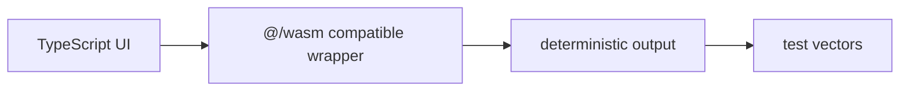

## 구현은 작은 로컬 실험에서 시작합니다

실제 zkTLS 시스템은 transcript 처리, 회로 설계, 증명 생성, 검증, 키 관리, 개인정보 최소화 정책을 모두 다룹니다. 이 장에서는 외부 API를 호출하지 않고, 더미 데이터와 로컬 계산만으로 구현 감각을 익힙니다. 목표는 실서비스 데이터를 가져오는 것이 아니라, 어떤 값을 공개 입력으로 두고 어떤 값을 비공개 입력으로 둘지, 그리고 같은 입력이 같은 커밋먼트로 이어지는지 확인하는 것입니다.

<HashLab />

## 더미 응답과 공개 주장 나누기

먼저 로컬 더미 응답을 만듭니다. 이 응답은 네트워크에서 온 값이 아니라 문서 안에서만 쓰는 예시입니다.

```ts
const mockResponse = {
  source: "local-sandbox",
  membershipTier: "gold",
  points: 1200,
  issuedAt: "2026-07-02T00:00:00.000Z",
};

const publicClaim = {
  requiredTier: "gold",
  minPoints: 1000,
};

const privateInput = {
  membershipTier: mockResponse.membershipTier,
  points: mockResponse.points,
};
```

증명 시스템에서는 공개 입력과 비공개 입력을 구분해야 합니다. 공개 입력은 검증자가 알아도 되는 값입니다. 비공개 입력은 조건 계산에는 필요하지만 직접 공개하고 싶지 않은 값입니다. 위 예시에서는 `requiredTier`와 `minPoints`가 공개 주장이고, 실제 응답의 값은 비공개 입력처럼 취급됩니다.

## 로컬 검증 함수

장난감 검증 함수는 다음처럼 작성할 수 있습니다. 실제 회로는 TypeScript 함수와 다르지만, 어떤 조건을 검증 가능한 연산으로 바꾸는지 이해하는 데 도움이 됩니다.

```ts
function verifyLocally(
  input: { membershipTier: string; points: number },
  claim: { requiredTier: string; minPoints: number },
) {
  return input.membershipTier === claim.requiredTier &&
    input.points >= claim.minPoints;
}

verifyLocally(privateInput, publicClaim);
```

<WasmDemo />

## WASM 호환 결정론적 함수

브라우저에서 증명 생성이나 검증 보조 로직을 실행하려면 같은 입력이 언제나 같은 출력으로 이어져야 합니다. 원래 요구사항은 Rust로 작성한 작은 함수를 `wasm-pack`으로 빌드하는 것입니다. 이 로컬 환경에는 `wasm-pack`은 있지만 Rust 컴파일러가 없어, 동일한 `@/wasm` API를 가진 TypeScript 결정론적 래퍼를 제공합니다. UI에는 이 사실을 명확히 표시하고, test vector로 일관성을 검증합니다.



<CircuitPlayground />

## Toy circuit 편집기

회로는 일반 프로그램을 증명 시스템이 이해할 수 있는 제약 조건으로 바꾼 것입니다. 아래 Sandpack 편집기는 Circom 스타일의 작은 곱셈 주장을 보여줍니다. 실제 증명을 만들거나 외부 실행 환경으로 코드를 보내지 않습니다. 구조를 읽고 바꿔 보며, private input과 public input이 어떻게 나뉘는지 확인하는 용도입니다.

```ts
// educational pseudo-circuit
constraint membershipTier == "gold";
constraint points >= 1000;
public output eligible = true;
```

## 안전한 실습 체크리스트

- 실제 금융/소셜 API를 호출하지 않습니다.
- 실제 쿠키, 토큰, 계정 정보, PII를 입력하지 않습니다.
- 더미 JSON과 로컬 시뮬레이션만 사용합니다.
- “프라이버시 보호 증명”과 “검증 가능한 연산”이라는 목적을 유지합니다.

<div className="callout">
  <p>프로덕션 zkTLS 구현에는 회로 감사, transcript 검증, 재현 가능한 빌드, 브라우저 격리, 키 관리, 개인정보 최소화 검토가 필요합니다.</p>
</div>
